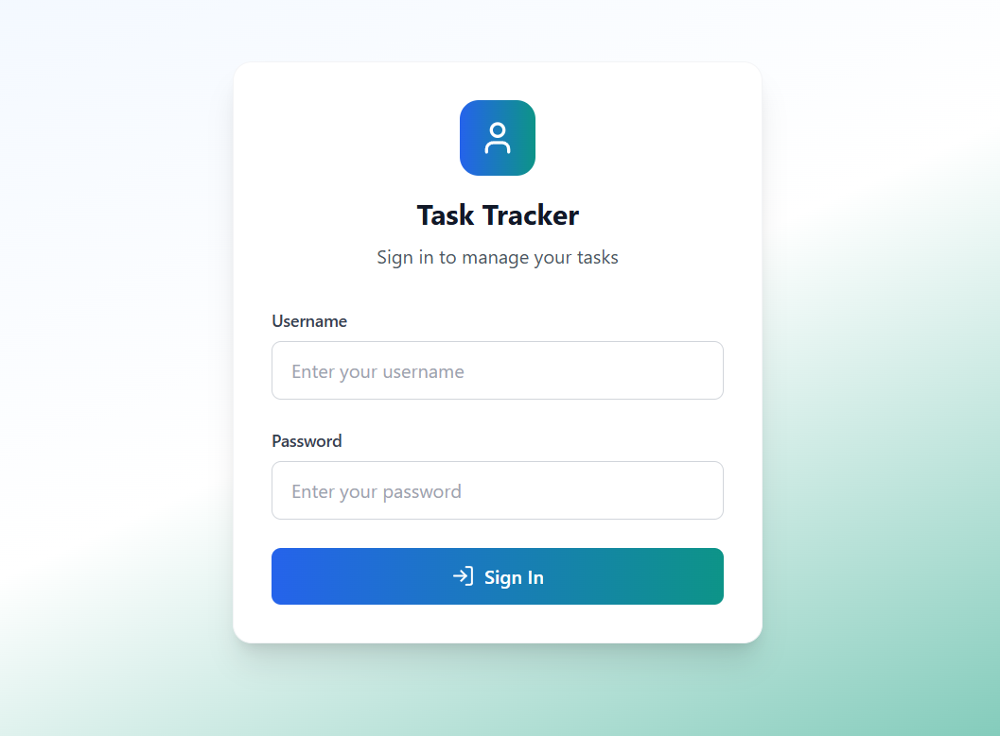
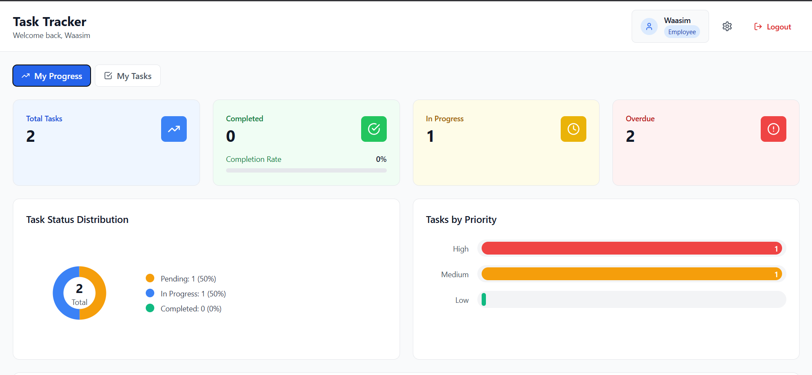

# 🧭 TaskFlow – Role-Based Task Management System

**TaskFlow** is a web-based task management system designed to streamline workflow and enhance collaboration between managers and employees.  
It implements **role-based access control (RBAC)** to ensure each user interacts with features relevant to their role — boosting efficiency, accountability, and data security.

🚀 **Live Demo:** [https://taskflow-lenok.netlify.app/](https://taskflow-lenok.netlify.app/)

---

## 📋 Table of Contents
- [About the Project](#about-the-project)
- [Key Features](#key-features)
- [Tech Stack](#tech-stack)
- [Project Screenshots](#project-screenshots)
- [Installation & Setup](#installation--setup)
- [Learning Outcomes](#learning-outcomes)
- [Contributing](#contributing)
- [License](#license)

---

## 🧠 About the Project

**TaskFlow** was developed as part of my internship at **Lenok Solutions**, an aviation-focused IT company specializing in custom software development.  
The project’s goal was to create a **scalable task management web app** where managers can assign and monitor tasks, while employees can view and update their own.

It emphasizes:
- Role-specific dashboards (Manager / Employee)
- Modern UI design with responsive layouts
- Smooth user experience powered by React SPA architecture

---

## 🌟 Key Features

- 🔐 **Role-Based Access Control:** Separate views and permissions for managers and employees  
- 🧭 **Manager Dashboard:** Create, assign, and monitor team tasks in real time  
- 🧑‍💻 **Employee Dashboard:** View, update, and complete assigned tasks  
- 💡 **Dynamic UI:** Built with reusable React components for scalability  
- 📱 **Fully Responsive:** Optimized for desktops, tablets, and mobile devices  
- ⚡ **Deployed on Netlify:** Accessible as a live single-page application  

---

## 🛠 Tech Stack

| Technology | Purpose |
|-------------|----------|
| **React (Vite)** | Frontend development & component architecture |
| **Tailwind CSS** | Modern responsive styling |
| **JavaScript (ES6+)** | Core logic, state management, and role handling |
| **Netlify** | Deployment and hosting |
| **Git & GitHub** | Version control and collaboration |

---

## 🖼 Project Screenshots

| Login Page | Employee Dashboard | Manager Dashboard |
|-------------|--------------------|--------------------|
|  |  |  |

*(Ensure your images are in `assets/screenshots/` and replace filenames as needed.)*

---

## ⚙️ Installation & Setup

Follow these steps to run **TaskFlow** locally:

```bash
# 1️⃣ Clone the repository
git clone https://github.com/your-username/taskflow.git

# 2️⃣ Move into the project folder
cd taskflow

# 3️⃣ Install dependencies
npm install

# 4️⃣ Start the development server
npm run dev

